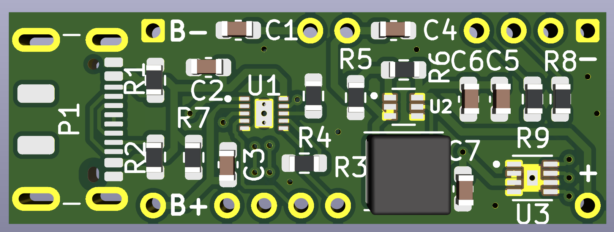
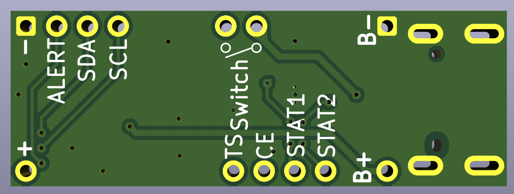

# **Battery-Management**
A repository to organize my battery management PCBs

## Single Cell 5 Volt Regulator

#### Chips used
* [BQ25185DLHR](https://www.ti.com/product/BQ25185) - Battery Charging 
* [TPS61023DRLT](https://www.ti.com/product/TPS61023) - Voltage Regulation
* [MAX17048G](https://www.analog.com/en/products/max17048.html) - Fuel Gauge
#### About 
This PCB is my first "real" PCB that I've designed from scratch using the datasheets of the three respective chips.
That aside this PCB is intended for easy battery support for prototyping with microcontroller development boards that require a stable 5 volt input. The board breaks out STAT1, STAT2, CE, and TS from BQ25185DLHR to allow data and control to the used microcontroller, and an external thermistor for battery safety. The board additionally has two pins meant to be used for an external on/off switch, marked on the back silkscreen. Like the battery charging IC the fuel gauges' data signals are also broken out to intended for use with the microcontroller. The USB type C port does not have it's data plus and data minus pins broken out, these are used as a differential pair which requires both wires to be exactly the same length and require impedance matching which all goes out the window when using external wires.
